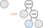
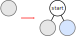
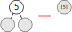
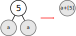

# Interval Tree

An interval tree is a data structure that is used for holding a collection of intervals in a way that allows for fast testing of what intervals overlap a point. By extending a binary search tree, this can be done in logarithmic time.

#### ADT

The public interface of this interval tree is:

- `add(start, end, name)`: Add the given interval to the tree
- `remove(name)`: Remove the given interval from the tree
- `clear()`: Remove all items from the tree
- `getEndpoints(name)`: Return a tuple containing the start and end of the given interval
- `testPoint(point)`: Return a set of all of the intervals that overlap with the given point
- `testRange(start, end)`: Return a set of all the intervals that overlap with the given interval

All intervals in this tree (including the arguments to `testRange`) are endpoint inclusive.

Each node in the tree stores that intervals that it covers, as well as a boundary value if it is not a leaf. Each node also stores the names of the intervals have been inserted into it.

The tree itself stores all of endpoints for the intervals contained in it. This is used for the `getEndpoints` method, but more importantly it is used to significantly optimize the removal method.

#### Background

For a collection of intervals on the number line, the corresponding elementary intervals are created by breaking it up wherever one interval start or ends. An example of this is shown below.


Each node in the interval tree represents a subinterval. The root always represents the interval (-∞, ∞). For leaf nodes, these subintervals correspond to the elementary intervals of the nodes. Non-leaf nodes also contain a boundary value. The nodes are arranged as a binary search tree with the boundaries as the keys. In this tree, the leaves are special because they have no boundary and are not considered in checking the binary search tree property.

Given a node that represents the interval [*x*, *z*]​ and has the boundary value *y*, then the left child of that node represents the interval [*x*, *y*] and the right child represents [*y*, *z*].

When an interval is stored in a tree, it is placed in the highest node which represents that interval. If there is already a boundary in the tree which is in the middle of the new interval to be inserted, this new interval can be broken up at that boundary value and be inserted into multiple nodes.


For example, to insert an interval named `a` covering [5, 10] to the above tree, the name `a` is just added to the yellow leaf node.

If you wanted to insert the interval `b` covering [5, 15] into this tree, the interval needs to be split up into [5, 10] and [10, 15]. This means that `b` is added to both the yellow and green leaf nodes.

An interesting note about this way of implementing an interval tree is that it can hold intervals with endpoints at infinity. To store the interval `c` covering (-∞, 10], you just put `c` into the node labeled 5. It is also possible to insert `c` into both the red and yellow nodes instead of the node with boundary value 5, but intervals should always be inserted in the most shallow node possible.

#### Implementation

The interval tree class is very simple. It keeps a dictionary of the intervals' endpoints, but for the most part it just delegates function calls to the root node.

````python
class IntervalTree:
    def __init__(self):
        self._root = IntervalNode()
        self._dict = {}

    def add(self, start, end, name):
        if not (start < end):
            raise ValueError("The start of an interval must \
                             be smaller than its end")
        if name in self._dict:
            raise ValueError("Interval with same name already in tree")
        self._root = self._root.add(start, end, name)
        self._dict[name] = (start, end)

    def remove(self, name):
        if not name in self._dict:
            raise KeyError("Interval not in tree")
        start, end = self._dict[name]
        self._root = self._root.remove(name, start, end)
        del self._dict[name]

    def clear(self):
        self._root = IntervalNode()
        
    def getEndpoints(self, name):
        return self._dict[name]
        
    def testPoint(self, point):
        return self._root.testPoint(point)

    def testRange(self, start, end):
        return self._root.testRange(start, end)

    def __repr__(self):
        return repr(self._root)
````


There node class contains a boundary value, the subinterval that it represents (`self.min` and `self.max`), and a set containing the names of each interval that has been added to it. The height is also kept for balancing the tree.

If the node has a boundary, that means it's not a leaf. Leaves have no children, while non-leaf nodes have other nodes for both children.

````python
class IntervalNode:
    def __init__(self, boundary = None, intervals = (), min = ninf, max = inf):
        self.boundary = boundary
        self.intervals = set(intervals)
        self.left = IntervalNode(min = min, max = boundary) \
                    if boundary is not None else None
        self.right = IntervalNode(min = boundary, max = max) \
                     if boundary is not None else None
        self.min = min
        self.max = max
        self._height = 0
````

There is also a function to output the tree as a formatted string.

````python
    def _nicerepr(self, n = 1):
        ret = (('B : ' + repr(self.boundary)) if not self._isleaf else "L")\
              + ' : ' + repr(list(self.intervals))
        if self.left is not None:
            ret += '\n' + '  ' * n + '< ' + self.left._nicerepr(n + 1)
        if self.right is not None:
            ret += '\n' + '  ' * n + '> ' + self.right._nicerepr(n + 1)
        return ret

    def __repr__(self):
        return self._nicerepr()
````
Then just a function to check if a node is a leaf.

````python
    @property
    def _isleaf(self):
        return self.boundary == None
````

##### Balancing

The next block contains the methods used for balancing the tree according to the AVL algorithm as shown in the textbook. Leaf nodes don't count towards the height of the tree because not having a boundary means they can't be rotated.

````python
    def _updateheight(self):
        if self._isleaf:
            return 0
        lheight = 0 if self.left._isleaf else self.left._height
        rheight = 0 if self.right._isleaf else self.right._height
        return 1 + max(lheight, rheight)

    def rebalance(self):
        bal = self._balance
        if bal < -1:
            if self.left._balance > 0:
                self.left = self.left._rotateleft()
            newroot = self._rotateright()
        elif bal > 1:
            if self.right._balance < 0:
                self.right = self.right._rotateright()
            newroot = self._rotateleft()
        else:
            return self

        return newroot
    
    @property
    def _balance(self):
        rheight = self.right._height if self.right else 0
        lheight = self.left._height if self.left else 0
        return rheight - lheight
````

Rotation is a bit more complicated in this tree than in a normal binary search tree. As shown below, after a rotation the old root and new root now represent different subintervals. This means that those two nodes need to be updated and the intervals contained in those nodes need to be moved around. In addition to this, leaf nodes can't be rotated so I raise an error in case it ever does happen.


For a right rotation as shown in the diagram above, there are three groups of interval movements that need to be done:

1. The intervals stored in the old root (10) are moved to the new root (5)
2. The intervals stored in the new root are moved into both the red and green nodes
3. The intervals in both the green and blue nodes are combined and moved up into the old root (10)

A left rotation works similarly. After this, the heights of the old and new roots also need to be updated.

The code for the rotations, then, is

````python
    def _rotateright(self):
        if self.left._isleaf:
            raise RotationError("Can't move a leaf node up")

        # Make copy of old intervals before clearing 
        oldrootintervals = set(self.intervals)
        newrootintervals = set(self.left.intervals)

        self.intervals.clear()
        self.left.intervals.clear()
		
        # A standard rotation
        newroot = self.left
        self.left = newroot.right
        newroot.right = self

        # Adjust subintervals represented by the nodes
        newroot.min = self.min
        newroot.max = self.max
        self.min = newroot.boundary
        
        # And the interval transfers mentioned above
        newroot.intervals = oldrootintervals

        newroot.left.intervals |= newrootintervals
        self.left.intervals |= newrootintervals

        # Join up any intervals that are in both children of oldroot
        both = self.left.intervals & self.right.intervals
        self.intervals |= both
        self.left.intervals -= both
        self.right.intervals -= both

        self._height = self._updateheight()
        newroot._height = newroot._updateheight()
        return newroot

    def _rotateleft(self):
        if self.right._isleaf:
            raise RotationError("Can't move a leaf node up")
        
        oldrootintervals = set(self.intervals)
        newrootintervals = set(self.right.intervals)

        self.intervals.clear()
        self.right.intervals.clear()

        newroot = self.right
        self.right = newroot.left
        newroot.left = self

        newroot.min = self.min
        newroot.max = self.max
        self.max = newroot.boundary

        newroot.intervals = oldrootintervals

        newroot.right.intervals |= newrootintervals
        self.right.intervals |= newrootintervals

        both = self.left.intervals & self.right.intervals
        self.intervals |= both
        self.left.intervals -= both
        self.right.intervals -= both

        self._height = self._updateheight()
        newroot._height = newroot._updateheight()
        return newroot
````


##### Adding Intervals

Adding nodes is a recursive process with many different cases. For this section, assume the interval being added is named `i` and covers [*start*, *end*].

First of all, if the interval to be added is equal to (or larger than) the subinterval represented by the current node, then the interval can be added to that node's set. If this condition is met, there's no need to check the cases described below.

After this, the cases can be split up into those that apply at leaf nodes and those that apply at non-leaf nodes.

###### Current Node is a Leaf

Note that when converting a leaf node to a non-leaf node, you need to make sure that both children are created.

1. **The current node's interval contains both *start* and *end*:** In this case, the current node is given the boundary value *start*. Its right child is a node with boundary value of *end*. Recursively call the add method on this newly created right child. This ends up adding the interval `i` to the node highlighted below.

   

2. **The current node's subinterval contains *start* but *end* is either outside or on the edge of the subinterval:** In this case, the current node is given the boundary value *start*. The right child of the current node becomes a leaf containing `i`.

   

3. **The current node's subinterval contains *end* but *start* is either outside or on the edge:** In this case, the current node is given the boundary value *end*. The left child of the currently node becomes a leaf containing `i`.

   

###### Current Node is not a Leaf

There are two cases that are checked.

1. If the start is less than the boundary, recursively call the add method on the left child. Otherwise, recursively call the add method on the right child.
2. If the end is greater than the boundary, recursively call the add method on the right child. Otherwise, recursively call the add method on the left child.

It's important to realize that you do not want to recursively call add on the same child twice, so I combined the cases that will call add on the left child and I combined the cases that will call add on the right child.

After adding the nodes, the tree is then rebalanced. Putting all of this together, here is the add method:

````python
    def add(self, start, end, name):
        # The case that applies to all nodes
        if start <= self.min and end >= self.max:
            self.intervals.add(name)

        # Leaf cases
        elif self._isleaf:
            # Cases 1 and 2
            if start > self.min:
                self.boundary = start
                # If it's not a leaf I need to make sure it has both children
                self.left = IntervalNode(min = self.min, max = self.boundary)
                # Case 1
                if end < self.max:
                    self.right = IntervalNode(end,
                                              min = self.boundary,
                                              max = self.max)
                    # The recursive call completes the process as shown in the diagram
                    self.right = self.right.add(start, end, name)
                # Case 2
                else:
                    self.right = IntervalNode(None,
                                              {name},
                                              min = self.boundary,
                                              max = self.max)
            # Case 3
            elif end < self.max:
                self.boundary = end
                self.left = IntervalNode(None,
                                         {name},
                                         min = self.min,
                                         max = self.boundary)
                self.right = IntervalNode(min = self.boundary, max = self.max)

        # Non-leaf cases
        else:
            # Case 1
            if start < self.boundary or end <= self.boundary:
                self.left = self.left.add(start, end, name)
            # Case 2
            if start >= self.boundary or end > self.boundary:
                self.right = self.right.add(start, end, name)

        # Balancing operations
        if not self._isleaf:
            self.left._height = self.left._updateheight()
            self.right._height = self.right._updateheight()
        self._height = self._updateheight()

        return self.rebalance()
````

##### Removal

For removal, you traverse the the tree, ending each path when it finds a node containing the interval to be removed or until it reaches a leaf. The paths that need to be traversed are narrowed down based on the endpoints of the interval to be removed.

Removing an interval can potentially leave unnecessary nodes in the tree, though. This implementation has six cases to remove unnecessary nodes. More conditions can be added, but they get complicated very fast.

1. If a node has two empty non-leaf children, it can be replaced with a leaf that contains the same intervals as the parent.

   

2. If a node has two identical children, that node can be replaced by either child combined with the parent node's intervals.

   

3. If the right child and the left-right grandchild are identical, the current node can be replaced with its left child.

   

4. The mirror of number three: If the left child and right-left grandchild are identical, the current node can be replaced with its right child.

   

5. If the current node's left child has no intervals and it's left-right and right-left grandchildren have the same intervals, the tree can be replaced as shown.

   

6. The mirror of number five: This time, the right child has no intervals.

   

After checking these conditions and removing any unnecessary nodes, the tree is then rebalanced. Here it is in code, with a few extra utility methods:

````python
    # Case 1
    @property
    def _emptychildren(self):
        return not self._isleaf and \
               self.left._isleaf and \
               self.right._isleaf and \
               self.left.intervals == self.right.intervals

    # Case 2
    @property
    def _samechildren(self):
        return not self._isleaf and \
               self.left._isleaf and \
               self.right._isleaf and \
               self.left.intervals == self.right.intervals

    # Case 3
    @property
    def _canreplacewithleft(self):
        return not self._isleaf and \
               len(self.left.intervals) == 0 and \
               not self.left._isleaf and \
               self.right._isleaf and \
               self.right.intervals == self.left.right.intervals

    # Case 4
    @property
    def _canreplacewithright(self):
        return not self._isleaf and \
               len(self.right.intervals) == 0 and \
               not self.right._isleaf and \
               self.left._isleaf and \
               self.right.left.intervals == self.left.intervals

    # Case 5
    @property
    def _canrestructureright(self):
        return not self._isleaf and \
               not self.left._isleaf and \
               not self.right._isleaf and \
               len(self.left.intervals) == 0 and \
               self.left.right.intervals == self.right.left.intervals and \
               self.left.right._isleaf and \
               self.right.left._isleaf

    # Case 6
    @property
    def _canrestructureleft(self):
        return not self._isleaf and \
               not self.left._isleaf and \
               not self.right._isleaf and \
               len(self.right.intervals) == 0 and \
               self.left.right.intervals == self.right.left.intervals and \
               self.left.right._isleaf and \
               self.right.left._isleaf

    def remove(self, interval, start, end):
        if interval in self.intervals:
            self.intervals.remove(interval)
        elif not self._isleaf:
            if self.boundary >= start:
                self.left = self.left.remove(interval, start, end)
            if self.boundary <= end:
                self.right = self.right.remove(interval, start, end)

        # Removing unnecessary nodes
        if self._emptychildren:
            self.__init__(None, self.intervals, min = self.min, max = self.max)
        if self._samechildren:
            self.__init__(None, self.left.intervals, self.min, self.max)
        if self._canreplacewithleft:
            newl = self.left.left
            newr = self.left.right
            self.__init__(self.left.boundary, self.left.intervals, \
                          min = self.min, max = self.max)
            self.left = newl
            self.right = newr
        if self._canreplacewithright:
            newl = self.right.left
            newr = self.right.right
            self.__init__(self.right.boundary, self.right.intervals, \
                          min = self.min, max = self.max)
            self.left = newl
            self.right = newr
        if self._canrestructureright:
            newl = self.left.left
            newr = self.right
            self.__init__(self.left.boundary, self.intervals, self.min, self.max)
            self.left = newl
            self.right = newr
        if self._canrestructureleft:
            newl = self.left.left
            newr = self.right
            self.__init__(self.left.boundary, self.intervals, self.min, self.max)
            self.left = newl
            self.right = newr
            
        # Balancing operations
        if not self._isleaf:
            self.left._height = self.left._updateheight()
            self.right._height = self.right._updateheight()
        self._height = self._updateheight()

        return self.rebalance()
````

##### Testing Points

The process for testing point intersections is simple:

If the given point is in the current node, add the intervals in that node to the return value.

Then, if the point is less than or equal to the boundary, recursively check the left child. If it's greater than or equal, recursively check the right child.

````python
    def testPoint(self, point):
        ret = set()
        if self.min <= point <= self.max:
            ret |= self.intervals
        if not self._isleaf:
            if point <= self.boundary:
                ret |= self.left.testPoint(point)
            if point >= self.boundary:
                ret |= self.right.testPoint(point)
        return ret 
````

##### Testing Ranges

The process for testing intersection with a range is similar to the process for testing with a point:

````python
def testRange(self, start, end):
        ret = set()
        if self.max >= start and self.min <= end:
            ret |= self.intervals
        if not self._isleaf:
            if start <= self.boundary:
                ret |= self.left.testRange(start, end)
            if self.boundary <= end:
                ret |= self.right.testRange(start, end)
        return ret
````

#### Analysis

The running time of testing a point using this interval tree is *O(log n)*, with *n* being the total number of nodes in the tree. The method will at most traverse two paths of height *log n* (If the point to test is the root's boundary value), which becomes *O(log n)*

The running time of testing a range is *O(n)*. If the given range is negative infinity to infinity, the function will need to traverse the whole tree to find the intervals.

Rotation takes *O(k)*, where *k* is the number of intervals in the nodes that are moved around. This is because those intervals need to be moved between nodes, which includes making a copy of the set containing them. Balancing has the same runtime.

Adding an intervals takes *O(k + log n)*. The *k* comes from rotations and the *log n* comes from traversing the tree to add to the nodes. With the most unbalanced AVL tree possible and adding an interval that requires two new added nodes, the tree is only rotated twice, so that is two or fewer *O(k)* operations for adding an interval.

The running time of removal is *O(k log n)*. The method traverses some paths down the tree which have maximum length *log n*. From there, each of the conditions that are checked are *O(k)*, since they compare the sets of intervals. These checks are done at each node, so this ends up as *O(k log n)*.

Clearing the tree and getting endpoints are constant time operations, as are all other methods in the `IntervalNode`.